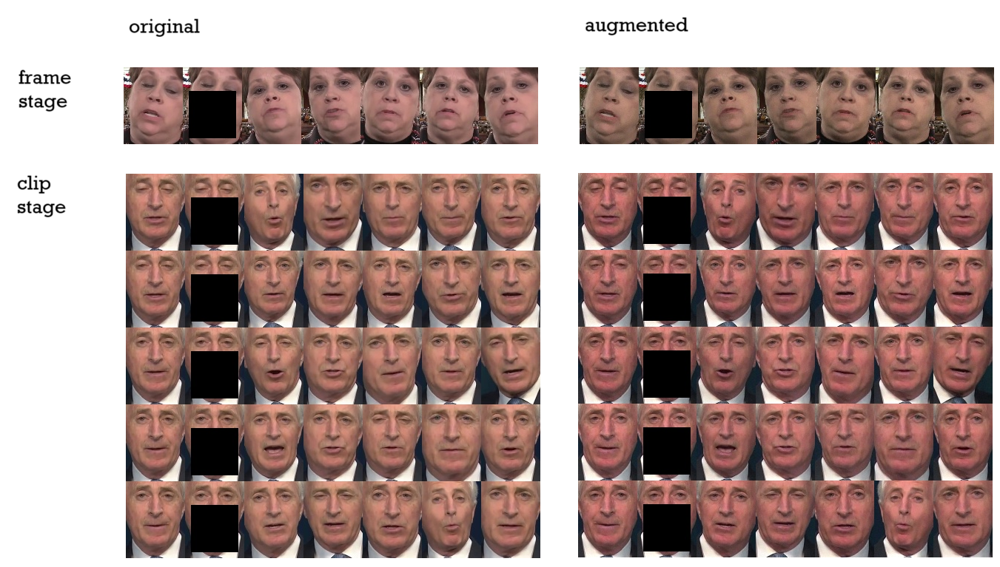

# Data augmentations proposal

As seen from the training code, there are no data augmentations made in both frame and clip stages.
Data augmentations can be used to make the network generalize better, and to make the network more robust to noise.
Also, data augmentations can be used to overcome some issues in the generated videos.

There is a 'Limitations' section in the paper, where the authors describe some issues in the generated videos.
One of the challenges is the change of lighting conditions in the source videos. Also, mentioned in the readme.md file,
the HDTF dataset used to train consists only of 363 videos, potentially limiting the generalization of the model.

## Data augmentations

I propose to apply the following data augmentations to video frames:
* Random horizontal flip (applied to source and reference frames in the same state)
* Random brightness, contrast, gamma and hue (applied to source and reference frames in the same state)
* Slight random changes to brightness, contrast and gamma, applied in frame-by-frame manner.
* Random gaussian noise

These augmentations address the issues mentioned above.
I don't propose to use random crop and scale augmentations. After analyzing samples generated from the original 
(non-augmented) dataset, I've found lots of scale and face pose variations are already present.

## Audio augmentations

DINet uses pretrained DeepSpeech model to extract features from the audio. DeepSpeech audio features are extracted 
before the training stages. Features are then saved to the disk.
In order to augment audio data, the easiest way would be to save multiple copies of the same
audio file with different augmentations to the disk. Runtime augmentations are not easy to implement as the DeepSpeech
model used is a TensorFlow model, while the rest of the network is implemented in PyTorch.
However, the DeepSpeech model is trained with lots of audio augmentations so there is a hope that the audio 
features are robust enough.
For more details please see (https://deepspeech.readthedocs.io/en/r0.9/TRAINING.html)

### Implementation

You can find the implementation of the augmentations in the `dataset/augmenter.py` file.
Random state of the augmentations is initialized when the `Augmenter` object is created. Once created, the object
can be used on multiple frames, and the augmentations will be applied in the same state to all of them. Except
for random gaussian noise and slight random changes to brightness, contrast and gamma, which are applied in 
frame-by-frame manner.

Both datasets were modified to use the augmentations. The `dataset/dataset_DINet_clip.py` and `dataset/dataset_DINet_frame.py`.

### Results

In order to visualize samples given to the network, I created `dataset_sampler_frame.py` and `dataset_sampler_clip.py` 
scripts. 
They sample one epoch of each dataset and save visualizations to `./asserts/debug_frame` and `./asserts/debug_clip` folders.
In order to run the scripts, you need to download some samples from the dataset and put them into `./asserts` folder.
The link is here: https://drive.google.com/file/d/1-ZOOTMJIwIMoelGvvDFCy3ka3GWDWJE-/view?usp=sharing

Here is the visualization of a few original and augmented samples:

### Notes on training in clip mode

Training dataset for clip mode samples a 5-frame clip from each video. For the clip the dataset also samples 5 reference 
frames. In the original implementation, the reference frames are sampled independently for each target frame in the clip. So
for 5 target frames, 25 different reference frames are sampled.
On the other hand in inference mode, the reference frames are sampled once for the whole video. This is not consistent.
It is hard to say if this training approach leads to better generalization as that can be viewed as additional data augmentation.
I would rather avoid this inconsistency and sample reference frames once for the whole video clip during training.
My approach can only be tested with full retraining of the clip stage.

## Other issues

I've run inference script with the pretrained model on a few test videos. Here is one of the resulting video:
    

As can be seen in the video, main artifacts are on the edges of the mouth region. Especially visible in the lower left 
and right corners of the mouth mask box. 

I've studied the DINet paper and there is a module, called AdaAT. The block applies affine transformation to the
whole feature maps. My hypothesis is that the best accuracy of AdaAT achieved in the middle of the mouth mask box and not
on the edges. This is due to the design of the block. Also, the block is applied on the feature maps after convolutional 
processing of concatenation of 5 reference frames. This creates pixel-wise misalignment which is hard to deal with
in the first convolutional layers, due to limited receptive field.

Bottom left and right corners of the mouth mask contains the most variation due to arbitrary hair movement and 
background. This variation is very hard to model with affine transformations. 

One way to deal with this issue is to use accurate face mask. The mask would allow to copy hair and background back from
the source frame.

Another possible way is to add more spatial context around the mouth mask. This would require increase of the size of the
frame crop and lead to more computations. However, this would allow to model the hair and background better as
the pixels in the corners will be better conditioned.

## Additional data that can help to get improved results

The AdaAT block doesn't use any information about the audio of reference frames. This makes it hard to align the mouth.
Addition of audio signal doesn't require big changes in the network architecture. And it is not hard to get audio features
for reference frames as they are present in the dataset.

## Notes on the dataset original implementation

There are some things in the dataset implementation that can be improved:
* image resizing is done using calls to `cv2.resize` function. The interpolation parameter is not set, so the default
interpolation is used. The default interpolation is `cv2.INTER_LINEAR` which is not the best choice for downscaling.
  (see, https://docs.opencv.org/3.4/da/d54/group__imgproc__transform.html#ga47a974309e9102f5f08231edc7e7529d)
* image is converted to float64 data type. This is not necessary as the network is trained with float32 data type. This 
also leads to increased memory and compute when using augmentations. 